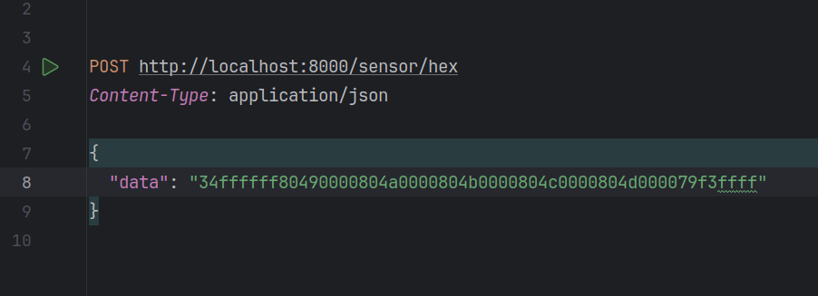
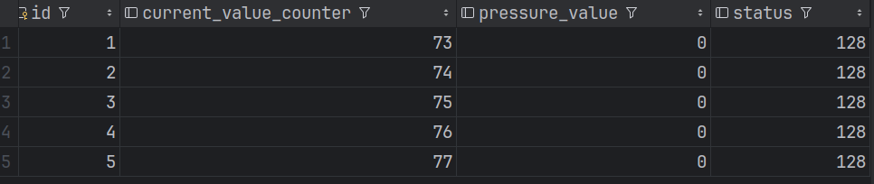
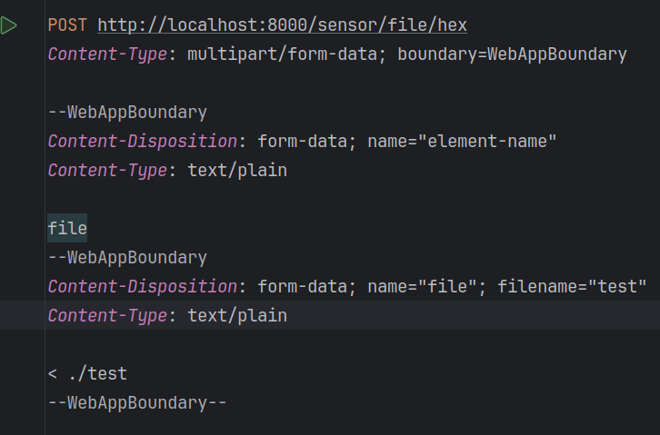
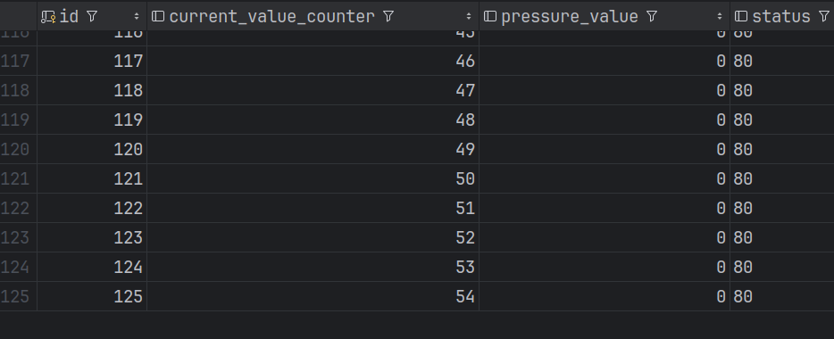

Написал два обработчика для информации с датчика:
1) "Строгий" - последовательно читает байт за байтом, не допуская пропусков
2) "Мягкий" - ищет в данных последовательности начинающиеся на 0x80, и обрабатывает уже их,
может пропустить ненужные данные

Какой именно обработчик нужно использовать я не понял ¯⁠\⁠_⁠(⁠ツ⁠)⁠_⁠/⁠¯

Информацию о статусе я храню как строку,
чтобы сохранить в неё 16-представление, не уверен,
что это имелось ввиду, но на картинке нарисовано так, 
и информация о том в каком формате хранить статус нет

Тест 1:  

Результат в базе

Тест 2: 

Ответ сервера:

 
Результат в базе:
